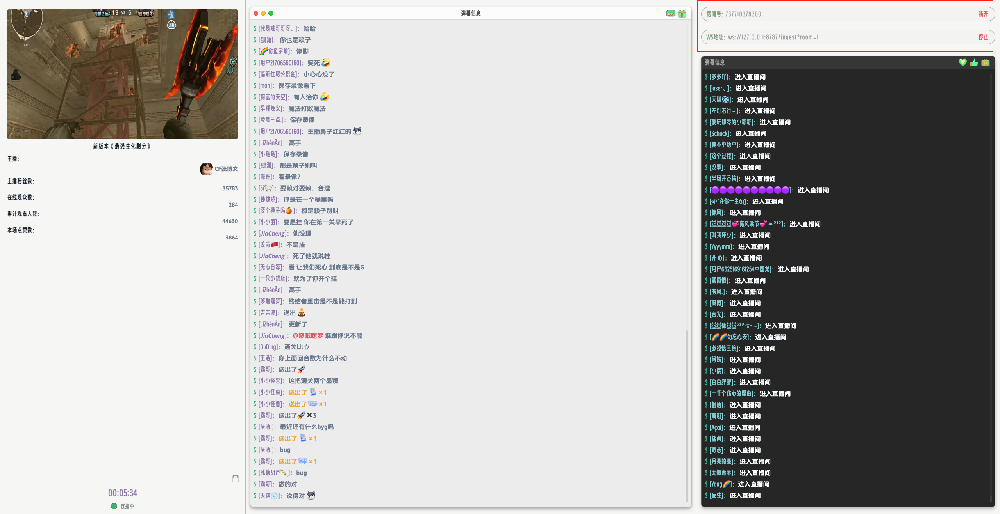
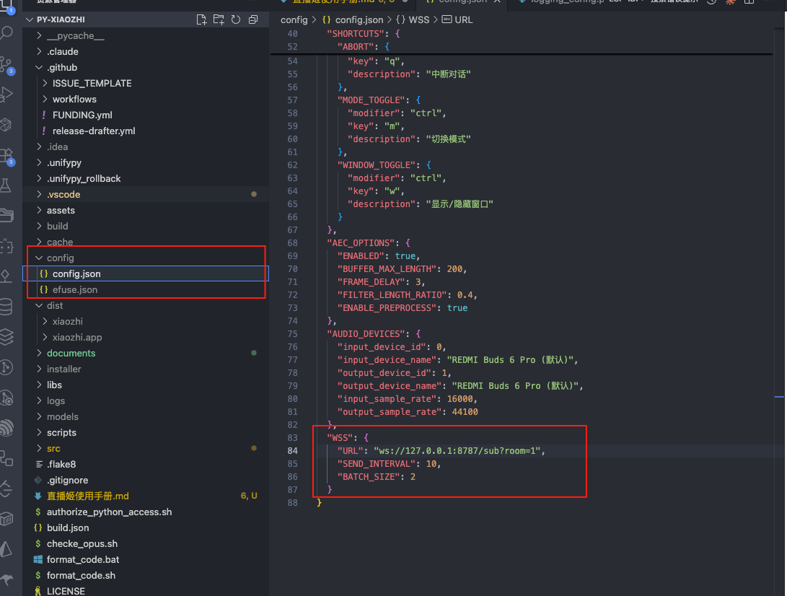
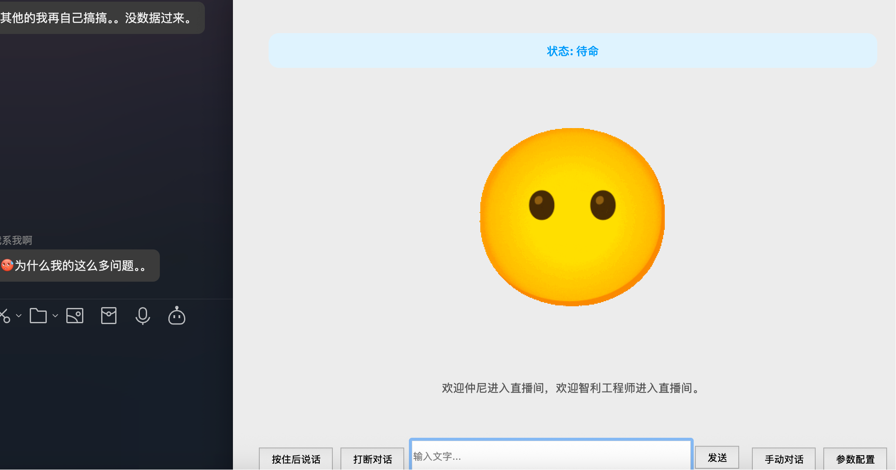

## 获取直播姬代码

```
git clone https://github.com/skmcj/dycast.git

cd dycast

npm install

npm run dev

```

- 查看下图右上角填写需要转发的直播间房号
- 转发的wss链接默认填写和图片一样就行了，也可以把1改为和直播间号一样
- 状态和我图片一样即可



## 配置参数



## 启动转发程序

- 在py-xiaozhi根目录执行
  
```
pip install 'uvicorn[standard]' fastapi websockets

python wss.py

python main.py
```


